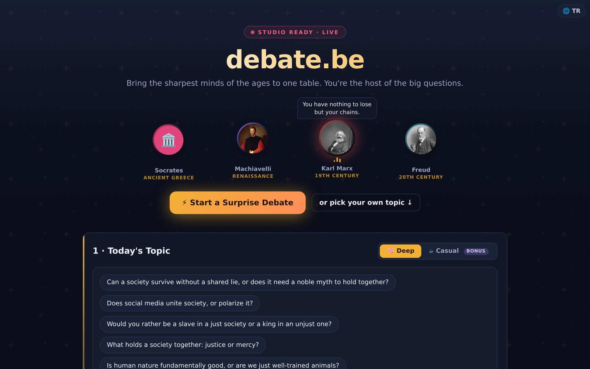

# debate.be 🎙️

🇬🇧 English · 🇹🇷 [Türkçe](README.tr.md)

**An AI talk show where history's greatest minds debate each other, and you're the host.**

Socrates vs. Machiavelli. Hobbes vs. Nussbaum. Marie Curie vs. anyone you like.
Guests interrupt each other, land jabs, catch each other's mistakes, occasionally concede,
and always act like the smartest person at the table. You give the floor, steer the
conversation, shout "stop", or change the subject. With full HD voices.

**Try it live: [debate.be](https://debate.be)** (no sign-up)



The UI picks English or Turkish from your browser language. **The session follows the
language of the topic**: open an English topic and the whole table debates in English.

## Two modes

- **🧠 Debate Arena.** Deep, heated philosophical, historical and social debate.
  The ratings meter rises with *conflict*.
- **☕ Chat Arena.** Daytime-TV talk-show tone, celebrities at the table, a gushing host.
  The ratings meter rises with *laughter*.

The **ratings meter** tracks how lively the room is. When it bottoms out, it calls on you
to step in.

## How it works

- **Guest selection.** People genuinely *relevant* to the topic are suggested (relevance
  before variety). Two guests by default, since the duel format flows best; add more from
  the shelf or by search. Each guest is enriched live with their Wikipedia summary and photo.
- **Personas.** Every guest gets their own system prompt fed with their Wikipedia text.
  They speak in the tone of their era, stay true to who they were, keep replies short and
  human, stumble and correct themselves, and react naturally ("uhh", "aah", a cough).
- **The director.** An invisible orchestrator reads the transcript every turn and decides,
  in a single JSON call, who speaks next, in what role, and the current rating.
- **Heating up.** When tension peaks, a rival guest cuts the speaker off mid-sentence
  (the audio really stops), the interrupted guest snaps back, the host steps in, and an
  intervention screen opens (with a "let them fight" option).
- **Look-ahead pipeline.** The next turn (director + line + audio) is prepared while the
  current one is playing, so text and voice start instantly. If the host interrupts, the
  prepared turn is thrown away and regenerated in the new direction.
- **Host interventions.** Type a message and it goes in as soon as the current line
  *finishes* (never cut in half); guests react to what you said. Call a guest by name
  and they answer.
- **Idle guard.** If the host doesn't take part for 3 minutes, the session pauses politely
  with steering questions, so it doesn't burn tokens.
- **Content safety.** A deterministic pre-filter plus an LLM check. Topics built to insult
  sacred figures are refused and no guests are called.

## Voices

Each guest is assigned a distinct voice by gender, era and style; the host has their own.

- **Demo engine:** Google Cloud TTS Chirp 3 HD, with a per-IP daily character limit.
- **Bring your own key:** enter your own Gemini or ElevenLabs key in ⚙️ settings and the
  whole session uses it, unlimited.
- **Fallback:** with no key or when the quota runs out, it falls back to the browser's
  Web Speech API with no interruption.

All audio goes through the `/api/tts` proxy; user keys are never stored on the server.

## Language model

The proxy uses the DeepSeek API by default; Groq, OpenAI and Claude keys also work
(detected from the key prefix).

- **Demo mode:** the server's key, with a per-IP daily request limit.
- **Bring your own key:** stored only in your browser's localStorage, sent per request in
  a header, never persisted on the server.

## Published sessions and SEO

Finished sessions are published anonymously to a public gallery (opt-out: the result
screen tells you and lets you remove it with one click). Each one becomes a server-rendered,
indexable transcript page at `debate.be/s/:slug` with meta, Open Graph and JSON-LD tags,
listed in a dynamic sitemap.

Gallery data and demo counters live in Supabase (RLS-locked tables, all access through
`SECURITY DEFINER` RPCs). Without Supabase, counters fall back to memory.

## Run it locally

```bash
npm install
export DEEPSEEK_API_KEY=sk-...      # optional: language-model demo
export GOOGLE_TTS_API_KEY=...       # optional: HD voice demo
npm run dev
```

Open http://localhost:5173. `npm run dev` is all you need: the `api/` endpoints run through
Vite middleware with the same logic as the Vercel functions. Without any server keys,
the app still works in bring-your-own-key mode.

## Deploy (Vercel)

Connect the repo to Vercel; "Vite" is detected automatically and `api/` becomes serverless
functions.

| Variable | Purpose |
|---|---|
| `DEEPSEEK_API_KEY` | Language-model demo (without it: bring-your-own-key only) |
| `GOOGLE_TTS_API_KEY` | HD voice demo (Cloud TTS Chirp 3 HD) |
| `ELEVENLABS_API_KEY` | Alternative voice demo (optional) |
| `SUPABASE_URL` / `SUPABASE_ANON_KEY` | Persistent demo counters + gallery |
| `DEMO_DAILY_LIMIT` | LLM demo: requests / IP / day (default 150) |
| `TTS_DEMO_CHAR_LIMIT` | TTS demo: characters / IP / day (default 12000) |
| `DEEPSEEK_MODEL` / `GROQ_MODEL` / `OPENAI_MODEL` / `ANTHROPIC_MODEL` / `GEMINI_TTS_MODEL` / `ELEVENLABS_MODEL` | Model overrides (optional) |

## Project structure

```
api/
  chat.ts            LLM proxy entry point
  tts.ts             HD voice proxy (Chirp 3 HD / ElevenLabs / Gemini)
  context.ts         Current-topic grounding (web summary)
  gallery.ts         Session gallery (publish / read / list / remove)
  session-page.ts    SSR indexable transcript for /s/:slug
  sitemap.ts         Dynamic sitemap
src/
  lib/
    wikipedia.ts     Guest selection + Wikipedia enrichment (TR/EN)
    prompts.ts       Persona, director, heat-up and safety prompts
    engine.ts        Director/guest calls + language safety net
    elevenTts.ts     HD voice client (voice assignment, cache, pipeline)
    safety.ts        Content safety (deterministic pre-filter)
    gamification.ts  Ratings, badges, season results
  components/        SetupScreen, HeroStage, ChatStream, RatingMeter, ModeratorBar, ...
  App.tsx            State machine + turn loop + look-ahead pipeline
```

## Disclaimer

Dialogue in sessions is **fictional, AI-generated portrayal**. It does not reflect or
speak for the real views of the real or historical people named. The goal is to provoke
thought and nourish a culture of debate.

## License

[MIT](LICENSE) © 2026 Alper Alyaz
